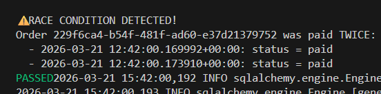
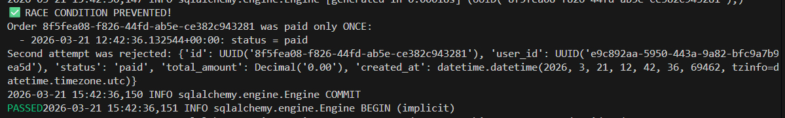

# Отчёт по лабораторной работе №2
## Управление конкурентными транзакциями в маркетплейсе

**Студент:** _[Ваше имя]_  
**Дата:** _[Дата]_

---

## Раздел 1: Описание проблемы

### Что такое Race Condition?

Race condition (состояние гонки) — это ситуация, когда несколько соединений получают доступ к одному и тому же ресурсу одновременно, что приводит к непредвиденным результатам

**Пример из жизни:**
- два человека хотят съесть последнее мороженое

### Почему READ COMMITTED не защищает от двойной оплаты?

На уровне изоляции READ COMMITTED:
1. Каждая транзакция видит те данные, которые были закомичены другими транзакциями на момент выполнения конкретного запроса. Незафиксированные - недоступны.
2. Когда две транзакции одновременно читают одни и те же данные, они могут получить одинаковое значение. Если затем обе транзакции выполняют вычисления на основе этого значения и пытаются записать результат, каждая из них не учитывает изменения, сделанные другой транзакцией, если те были зафиксированы уже после чтения.
3. В результате возникает нежелаемое состояние гонки.

**Демонстрация проблемы:**

```
Время | Сессия 1                    | Сессия 2
------|----------------------------|---------------------------
t1    | BEGIN                      |
t2    | SELECT status (created)    |
t3    |                            | BEGIN
t4    |                            | SELECT status (created)
t5    | pg_sleep(3)                |
t6    |                            | pg_sleep(3)
t7    | UPDATE status = paid       |
t8    |                            | UPDATE status = paid (ждет)
t9    | COMMIT                     |
t10   |                            | UPDATE выполняется...
t11   |                            | COMMIT
```

Сначала сессия 1 закомичивает данные, а затем сессия 2 ждет, пока сессия 1 не закоммитит их. Таким образом, сессия 2 видит данные, которые ещё не закомичены.

### Примеры из реальной жизни

1. **Двойной клик на кнопку "Оплатить"**
   - Пользователь нажимает кнопку дважды
   - Два HTTP-запроса приходят почти одновременно
   - Оба запроса начинают обработку параллельно

2. **Микросервисная архитектура**
   - Несколько сервисов обращаются к одним и тем же данным
   - Два запроса от разных сервисов приходят почти одновременно
   - Оба сервиса начинают обработку параллельно

3. **Сбой сети**
   - Клиент отправляет запрос (например, на оплату или перевод)
   - Из-за сетевой ошибки не получает ответ
   - Клиент повторно отправляет тот же запрос
   - Оба запроса начинают обработку почти одновременно

---

## Раздел 2: Уровни изоляции в PostgreSQL

### READ UNCOMMITTED

**Описание:**
Самый слабый уровень изоляции. Транзакция может читать даже те данные, которые ещё не были зафиксированы другими транзакциями

**Предотвращает:**
- Ничего

**Не предотвращает:**
- Dirty reads
- Non-repeatable reads
- Phantom reads

**Когда использовать:**
Подходит редко, когда очень важна скорость и допустимы неточные или временно несогласованные данные

**Особенность в PostgreSQL:**
В PostgreSQL READ UNCOMMITTED работает как READ COMMITTED из-за архитектуры MVCC.

---

### READ COMMITTED (по умолчанию)

**Описание:**
Каждый SELECT в транзакции видит только те данные, которые были зафиксированы до начала выполнения этого конкретного запроса.

**Предотвращает:**
- ✅ Dirty reads (чтение незакоммиченных данных)

**Не предотвращает:**
- ❌ Non-repeatable reads (повторное чтение дает другой результат)
- ❌ Phantom reads (новые строки появляются в результате запроса)

**Пример non-repeatable read:**
```sql
-- Сессия 1
BEGIN;
SELECT balance FROM accounts WHERE id = 1; -- Результат: 1000
-- Сессия 2 изменяет balance и делает COMMIT
SELECT balance FROM accounts WHERE id = 1; -- Результат: 500 (!)
COMMIT;
```

**Когда использовать:**
Подходит для большинства обычных сценариев, где важны производительность и отсутствие грязных чтений, но не требуется строгая стабильность снимка данных на всю транзакцию.

---

### REPEATABLE READ

**Описание:**
Транзакция видит один и тот же snapshot данных на момент начала транзакции: все последующие SELECT внутри этой транзакции работают с тем же снимком, даже если другие транзакции успели изменить и зафиксировать данные

**Предотвращает:**
- ✅ Dirty reads
- ✅ Non-repeatable reads
- ✅ Phantom reads (в PostgreSQL благодаря MVCC)

**Не предотвращает:**
- ❌ Write skew (специфичная аномалия)
- ❌ Некоторые сериализационные аномалии

**Особенность в PostgreSQL:**
В отличие от стандарта SQL, PostgreSQL на REPEATABLE READ также предотвращает phantom reads.

**Когда использовать:**
Подходит, когда важно, чтобы вся транзакция работала с одной и той же версией данных

---

### SERIALIZABLE

**Описание:**
Самый строгий уровень изоляции. PostgreSQL старается обеспечить такое поведение, как будто транзакции выполнялись строго по очереди, одна за другой. Если одновременное выполнение может привести к несогласованному результату, одна из транзакций будет отклонена с ошибкой сериализации

**Предотвращает:**
- ✅ Все аномалии чтения
- ✅ Сериализационные аномалии
- ✅ Write skew

**Недостатки:**
- ❌ Может откатывать транзакции при конфликтах (serialization failure)
- ❌ Снижение производительности
- ❌ Требует retry logic в приложении

**Пример serialization failure:**
```sql
-- Сессия 1
BEGIN ISOLATION LEVEL SERIALIZABLE;
SELECT SUM(balance) FROM accounts; -- 5000
UPDATE accounts SET balance = balance + 100 WHERE id = 1;

-- Сессия 2 (параллельно)
BEGIN ISOLATION LEVEL SERIALIZABLE;
SELECT SUM(balance) FROM accounts; -- 5000
UPDATE accounts SET balance = balance + 200 WHERE id = 2;

-- При COMMIT одна из транзакций получит ошибку:
-- ERROR: could not serialize access due to read/write dependencies
```

**Когда использовать:**
Подходит для критически важных операций, где важнее корректность, чем скорость. Обычно можно избегать, прибежаясь к REPEATABLE READ

---

### Сравнительная таблица

| Уровень изоляции  | Dirty Read | Non-Repeatable Read | Phantom Read | Performance | Use Case |
|-------------------|------------|---------------------|--------------|-------------|----------|
| READ UNCOMMITTED  | ❌          | ❌                   | ❌            | Высокая     | Аналитика (неточная) |
| READ COMMITTED    | ✅          | ❌                   | ❌            | Высокая     | Обычные операции |
| REPEATABLE READ   | ✅          | ✅                   | ✅*           | Средняя     | Критичные операции |
| SERIALIZABLE      | ✅          | ✅                   | ✅            | Низкая      | Финансовые транзакции |

_*В PostgreSQL REPEATABLE READ также предотвращает phantom reads благодаря MVCC._

---

## Раздел 3: Решение проблемы

### Почему REPEATABLE READ решает проблему?


REPEATABLE READ использует snapshot isolation:
1. Транзакция видит один и тот же snapshot
2. Это означает, что все последующие SELECT внутри этой транзакции работают с тем же снимком
3. Однако, без блокировок можно изменять данные, что может привести к несогласованным результатам

### Зачем нужен FOR UPDATE?

Для того, чтобы предотвратить write skew

`FOR UPDATE` создает эксклюзивную блокировку на уровне строки (row-level lock):

**Без FOR UPDATE:**
```sql
BEGIN ISOLATION LEVEL REPEATABLE READ;
SELECT status FROM orders WHERE id = '...';
-- Другая транзакция может прочитать ту же строку
UPDATE orders SET status = 'paid' WHERE id = '...';
COMMIT;
```

**С FOR UPDATE:**
```sql
BEGIN ISOLATION LEVEL REPEATABLE READ;
SELECT status FROM orders WHERE id = '...' FOR UPDATE;
-- Другая транзакция ЖДЕТ освобождения блокировки
UPDATE orders SET status = 'paid' WHERE id = '...';
COMMIT;
```

**Типы блокировок:**
- `FOR UPDATE` — эксклюзивная блокировка (никто не может изменить или заблокировать)
- `FOR SHARE` — разделяемая блокировка (другие могут читать с FOR SHARE, но не могут изменять)
- `FOR NO KEY UPDATE` — как FOR UPDATE, но разрешает concurrent FOR KEY SHARE
- `FOR KEY SHARE` — слабая блокировка (предотвращает DELETE и UPDATE ключевых полей)

### Что произойдет без FOR UPDATE на REPEATABLE READ?

Затем, чтобы предотвратить эту аномалию, можно использовать `FOR UPDATE`

Даже на REPEATABLE READ возможна аномалия:

```sql
-- Сессия 1
BEGIN ISOLATION LEVEL REPEATABLE READ;
SELECT status FROM orders WHERE id = '...'; -- created
-- Задержка...
UPDATE orders SET status = 'paid' WHERE id = '...' AND status = 'created';
COMMIT;

-- Сессия 2 (параллельно)
BEGIN ISOLATION LEVEL REPEATABLE READ;
SELECT status FROM orders WHERE id = '...'; -- created (snapshot!)
-- Задержка...
UPDATE orders SET status = 'paid' WHERE id = '...' AND status = 'created';
-- ЧТО ПРОИЗОЙДЕТ?
```

Здесь первая транзакция не заблокирована, а вторая может изменить данные

### Разница между FOR UPDATE и FOR SHARE

| Характеристика | FOR UPDATE | FOR SHARE |
|----------------|------------|-----------|
| Тип блокировки | Эксклюзивная | Разделяемая |
| Блокирует чтение с FOR UPDATE | ✅ | ✅ |
| Блокирует чтение с FOR SHARE | ✅ | ❌ |
| Блокирует UPDATE | ✅ | ✅ |
| Блокирует DELETE | ✅ | ✅ |
| Use case | Перед изменением | Защита от изменений |

**Пример использования FOR SHARE:**
```sql
-- Проверка наличия товара перед созданием заказа
SELECT quantity FROM products WHERE id = '...' FOR SHARE;
-- Товар не может быть удален или изменен до COMMIT
```

---

## Раздел 4: Рекомендации для продакшена

### Какой ISOLATION LEVEL использовать для продакшена маркетплейса?


**Рекомендация:** Для продакшена маркетплейса рекомендуется использовать **READ COMMITTED как default уровень** с явным использованием **REPEATABLE READ + FOR UPDATE для критичных операций**.

#### Обоснование:

**1. Производительность**
- READ COMMITTED имеет минимальный overhead
- REPEATABLE READ используется только там, где необходимо
- Избегаем глобального использования SERIALIZABLE

**2. Безопасность данных**
- Критичные операции (оплата, изменение баланса) защищены через REPEATABLE READ + FOR UPDATE
- Некритичные операции (просмотр каталога) работают на READ COMMITTED
- Четкое разделение зон ответственности

**3. Риски deadlock**
- FOR UPDATE может привести к deadlock при неправильном порядке блокировок
- Решение: всегда блокировать ресурсы в одном порядке
- Пример: сначала order, потом order_items, потом payment

**4. Простота разработки**
- READ COMMITTED легко понять и отлаживать
- REPEATABLE READ + FOR UPDATE требует explicit intent
- Код становится самодокументируемым

**5. Масштабируемость**
- READ COMMITTED хорошо масштабируется
- Локальное использование блокировок не создает bottleneck
- Connection pooling работает эффективно

### Альтернативные подходы

#### Подход 1: Использовать SERIALIZABLE везде

**Плюсы:**
- Максимальная корректность
- Не нужно думать о блокировках
- PostgreSQL автоматически обнаруживает конфликты

**Минусы:**
- Значительное снижение производительности (20-50%)
- Требует retry logic во всех операциях
- Высокий процент rollback при нагрузке
- Сложная отладка serialization failures

**Вывод:** Не рекомендуется для high-load систем.

#### Подход 2: Optimistic Locking (версионирование)

**Реализация:**
```sql
ALTER TABLE orders ADD COLUMN version INTEGER DEFAULT 1;

UPDATE orders 
SET status = 'paid', version = version + 1
WHERE id = '...' AND status = 'created' AND version = 1;

-- Проверить ROW_COUNT, если 0 — конфликт
```

**Плюсы:**
- Нет блокировок на чтение
- Хорошая производительность
- Масштабируется горизонтально

**Минусы:**
- Требует изменения схемы БД
- Требует retry logic в приложении
- Может быть много конфликтов при высокой нагрузке

**Вывод:** Хороший подход для распределенных систем.

#### Подход 3: Advisory Locks

**Реализация:**
```sql
BEGIN;
SELECT pg_advisory_xact_lock(hashtext('order_' || order_id));
-- Критическая секция
COMMIT; -- Блокировка автоматически снимается
```

**Плюсы:**
- Гибкий контроль блокировок
- Можно блокировать логические ресурсы
- Работает на любом уровне изоляции

**Минусы:**
- Легко забыть снять блокировку
- Сложнее отлаживать
- Требует дисциплины от разработчиков

**Вывод:** Полезно для специфичных случаев, но не как основной подход.

### Итоговая рекомендация

Для продакшена маркетплейса используйте **гибридный подход**:

1. **Default isolation level:** `READ COMMITTED`
   - Для обычных операций (чтение каталога, просмотр истории)
   - 95% операций

2. **REPEATABLE READ + FOR UPDATE:** для критичных операций
   - Оплата заказа
   - Изменение баланса
   - Резервирование товара
   - 5% операций

3. **Дополнительно:** Optimistic locking для операций с высокой конкурентностью
   - Обновление счетчиков
   - Изменение рейтингов

**Пример кода:**
```python
async def pay_order(order_id: UUID):
    async with db.transaction(isolation='repeatable_read'):
        # Заблокировать заказ
        order = await db.fetch_one(
            "SELECT * FROM orders WHERE id = $1 FOR UPDATE",
            order_id
        )
        
        if order['status'] != 'created':
            raise OrderAlreadyPaidError()
        
        # Обновить статус
        await db.execute(
            "UPDATE orders SET status = 'paid' WHERE id = $1",
            order_id
        )
        
        # Записать в историю
        await db.execute(
            "INSERT INTO order_status_history (order_id, status) VALUES ($1, 'paid')",
            order_id
        )
```

---

## Заключение

В ходе лабораторной работы было изучено:
1. Оновные подходы защиты от конкурентных операций
2. Плюсы и минусы различных подходов
3. Какие подходы лучше всего подходят для маркетплейса

Основные выводы:
- Подход `REPEATABLE READ + FOR UPDATE` лучше всего подходит для маркетплейса 
- Подход `READ COMMITTED` лучше всего подходит для обычных операций
- Подход `Optimistic Locking` лучше всего подходит для операций с высокой конкурентностью

---

## Приложение: Результаты тестирования

### Тест 1: Демонстрация проблемы (READ COMMITTED)



### Тест 2: Решение проблемы (REPEATABLE READ + FOR UPDATE)

_TODO: Вставьте скриншоты или вывод команд, демонстрирующие корректную работу._


